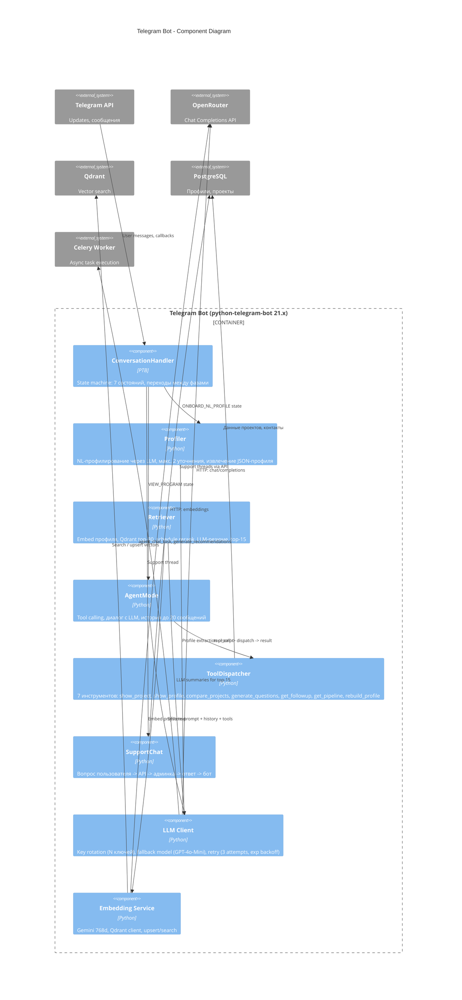

# C4 Component - Telegram Bot (Agent Core)

Внутренняя структура Telegram-бота - ядро агентской системы.

```mermaid
C4Component
    title Telegram Bot - Component Diagram

    Container_Boundary(bot, "Telegram Bot (python-telegram-bot 21.x)") {
        Component(conv, "ConversationHandler", "PTB", "State machine: 7 состояний, переходы между фазами")
        Component(profiler, "Profiler", "Python", "NL-профилирование через LLM, макс. 2 уточнения, извлечение JSON-профиля")
        Component(retriever, "Retriever", "Python", "Embed профиля, Qdrant top-30, schedule rerank, LLM-резюме, top-15")
        Component(agent_mode, "AgentMode", "Python", "Tool calling, диалог с LLM, история до 20 сообщений")
        Component(tool_dispatch, "ToolDispatcher", "Python", "7 инструментов: show_project, show_profile, compare_projects, generate_questions, get_followup, get_pipeline, rebuild_profile")
        Component(support, "SupportChat", "Python", "Вопрос пользователя -> API -> админка -> ответ -> бот")
        Component(llm_client, "LLM Client", "Python", "Key rotation (N ключей), fallback model (GPT-4o-Mini), retry (3 attempts, exp backoff)")
        Component(embedding, "Embedding Service", "Python", "Gemini 768d, Qdrant client, upsert/search")
    }

    System_Ext(telegram, "Telegram API", "Updates, сообщения")
    System_Ext(openrouter, "OpenRouter", "Chat Completions API")
    System_Ext(qdrant, "Qdrant", "Vector search")
    System_Ext(pg, "PostgreSQL", "Профили, проекты")
    System_Ext(celery, "Celery Worker", "Async task execution")

    Rel(telegram, conv, "User messages, callbacks")
    Rel(conv, profiler, "ONBOARD_NL_PROFILE state")
    Rel(conv, agent_mode, "VIEW_PROGRAM state")
    Rel(conv, support, "Support thread")
    Rel(profiler, llm_client, "Profile extraction prompt")
    Rel(retriever, embedding, "Embed profile text")
    Rel(retriever, llm_client, "LLM summaries for top-15")
    Rel(agent_mode, llm_client, "System prompt + history + tools")
    Rel(agent_mode, tool_dispatch, "tool_call -> dispatch -> result")
    Rel(tool_dispatch, pg, "Данные проектов, контакты")
    Rel(llm_client, openrouter, "HTTP: chat/completions")
    Rel(llm_client, celery, "agent_chat_task, generate_recommendations")
    Rel(embedding, openrouter, "HTTP: embeddings")
    Rel(embedding, qdrant, "Search / upsert vectors")
    Rel(support, pg, "Support threads via API")

    UpdateLayoutConfig($c4ShapeInRow="4", $c4BoundaryInRow="1")
```
