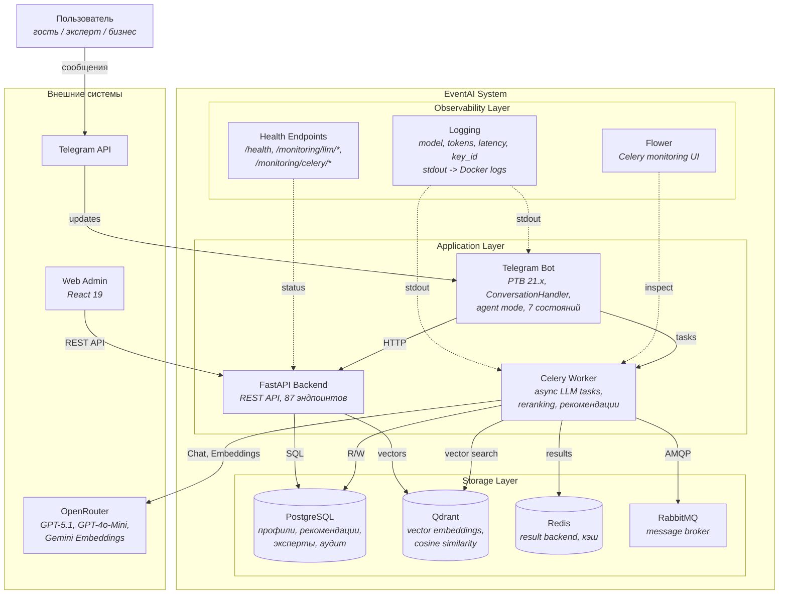

# C4 Container - EventAI Agent

Контейнеры системы EventAI с фокусом на агентскую часть. Web Admin - внешняя система.

```mermaid
flowchart TB
    user["Пользователь<br/><i>гость / эксперт / бизнес</i>"]

    subgraph eventai["EventAI System"]
        direction TB

        subgraph app["Application Layer"]
            bot["Telegram Bot<br/><i>PTB 21.x, ConversationHandler,<br/>agent mode, 7 состояний</i>"]
            api["FastAPI Backend<br/><i>REST API, 87 эндпоинтов</i>"]
            celery["Celery Worker<br/><i>async LLM tasks,<br/>reranking, рекомендации</i>"]
        end

        subgraph storage["Storage Layer"]
            pg[("PostgreSQL<br/><i>профили, рекомендации,<br/>эксперты, аудит</i>")]
            qdrant[("Qdrant<br/><i>vector embeddings,<br/>cosine similarity</i>")]
            redis[("Redis<br/><i>result backend, кэш</i>")]
            rabbitmq["RabbitMQ<br/><i>message broker</i>"]
        end

        subgraph observability["Observability Layer"]
            flower["Flower<br/><i>Celery monitoring UI</i>"]
            health["Health Endpoints<br/><i>/health, /monitoring/llm/*,<br/>/monitoring/celery/*</i>"]
            logging["Logging<br/><i>model, tokens, latency, key_id<br/>stdout -> Docker logs</i>"]
        end
    end

    subgraph external["Внешние системы"]
        telegram["Telegram API"]
        openrouter["OpenRouter<br/><i>GPT-5.1, GPT-4o-Mini,<br/>Gemini Embeddings</i>"]
        web_admin["Web Admin<br/><i>React 19</i>"]
    end

    user -->|"сообщения"| telegram
    telegram -->|"updates"| bot
    bot -->|"HTTP"| api
    bot -->|"tasks"| celery

    celery -->|"Chat, Embeddings"| openrouter
    celery -->|"vector search"| qdrant
    celery -->|"R/W"| pg
    celery -->|"AMQP"| rabbitmq
    celery -->|"results"| redis

    api -->|"SQL"| pg
    api -->|"vectors"| qdrant
    web_admin -->|"REST API"| api

    flower -.->|"inspect"| celery
    health -.->|"status"| api
    logging -.->|"stdout"| bot
    logging -.->|"stdout"| celery
```
