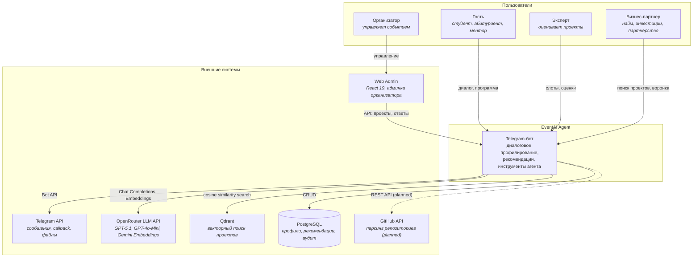

# C4 Context - EventAI Agent

Системный контекст агентской части EventAI. Пользователи, внешние системы и границы.

```mermaid
flowchart TB
    subgraph Users["Пользователи"]
        guest["Гость<br/><i>студент, абитуриент, ментор</i>"]
        expert["Эксперт<br/><i>оценивает проекты</i>"]
        business["Бизнес-партнер<br/><i>найм, инвестиции, партнерство</i>"]
        organizer["Организатор<br/><i>управляет событием</i>"]
    end

    subgraph System["EventAI Agent"]
        agent["Telegram-бот<br/>диалоговое профилирование,<br/>рекомендации, инструменты агента"]
    end

    subgraph External["Внешние системы"]
        telegram["Telegram API<br/><i>сообщения, callback, файлы</i>"]
        openrouter["OpenRouter LLM API<br/><i>GPT-5.1, GPT-4o-Mini, Gemini Embeddings</i>"]
        qdrant["Qdrant<br/><i>векторный поиск проектов</i>"]
        postgres[("PostgreSQL<br/><i>профили, рекомендации, аудит</i>")]
        github_api["GitHub API<br/><i>парсинг репозиториев (planned)</i>"]
        web_admin["Web Admin<br/><i>React 19, админка организатора</i>"]
    end

    guest -->|"диалог, программа"| agent
    expert -->|"слоты, оценки"| agent
    business -->|"поиск проектов, воронка"| agent
    organizer -->|"управление"| web_admin
    web_admin -->|"API: проекты, ответы"| agent

    agent -->|"Bot API"| telegram
    agent -->|"Chat Completions, Embeddings"| openrouter
    agent -->|"cosine similarity search"| qdrant
    agent -->|"CRUD"| postgres
    agent -.->|"REST API (planned)"| github_api
```
