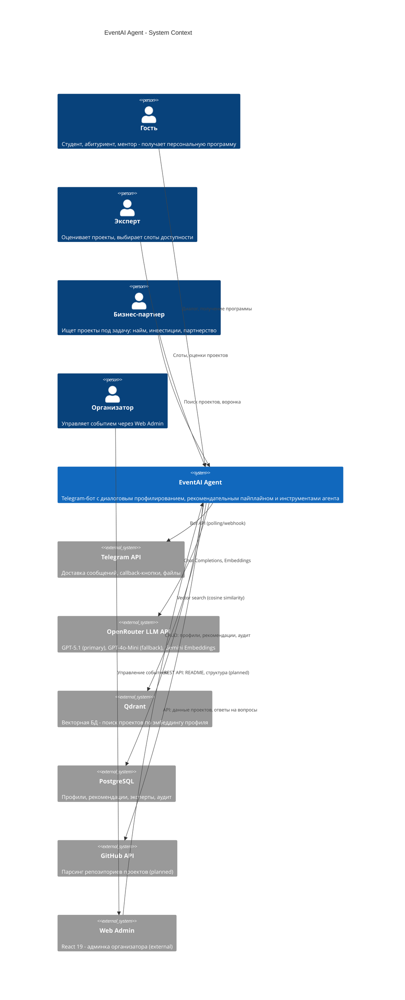

# C4 Context - EventAI Agent

Системный контекст агентской части EventAI. Показаны пользователи, внешние системы и границы.

```mermaid
C4Context
    title EventAI Agent - System Context

    Person(guest, "Гость", "Студент, абитуриент, ментор - получает персональную программу")
    Person(expert, "Эксперт", "Оценивает проекты, выбирает слоты доступности")
    Person(business, "Бизнес-партнер", "Ищет проекты под задачу: найм, инвестиции, партнерство")
    Person(organizer, "Организатор", "Управляет событием через Web Admin")

    System(agent, "EventAI Agent", "Telegram-бот с диалоговым профилированием, рекомендательным пайплайном и инструментами агента")

    System_Ext(telegram, "Telegram API", "Доставка сообщений, callback-кнопки, файлы")
    System_Ext(openrouter, "OpenRouter LLM API", "GPT-5.1 (primary), GPT-4o-Mini (fallback), Gemini Embeddings")
    System_Ext(qdrant, "Qdrant", "Векторная БД - поиск проектов по эмбеддингу профиля")
    System_Ext(postgres, "PostgreSQL", "Профили, рекомендации, эксперты, аудит")
    System_Ext(github_api, "GitHub API", "Парсинг репозиториев проектов (planned)")
    System_Ext(web_admin, "Web Admin", "React 19 - админка организатора (external)")

    Rel(guest, agent, "Диалог, получение программы")
    Rel(expert, agent, "Слоты, оценки проектов")
    Rel(business, agent, "Поиск проектов, воронка")
    Rel(organizer, web_admin, "Управление событием")
    Rel(web_admin, agent, "API: данные проектов, ответы на вопросы")

    Rel(agent, telegram, "Bot API (polling/webhook)")
    Rel(agent, openrouter, "Chat Completions, Embeddings")
    Rel(agent, qdrant, "Vector search (cosine similarity)")
    Rel(agent, postgres, "CRUD: профили, рекомендации, аудит")
    Rel(agent, github_api, "REST API: README, структура (planned)")

    UpdateLayoutConfig($c4ShapeInRow="3", $c4BoundaryInRow="1")
```
