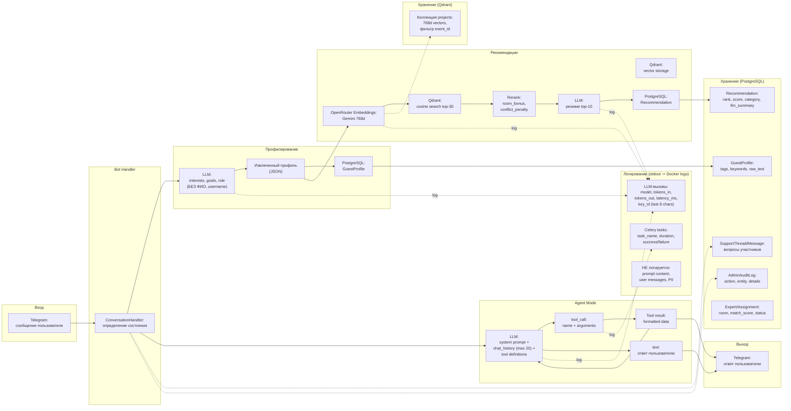

# Data Flow - Потоки данных в агенте

Что отправляется в LLM, что хранится в БД, что логируется. Направление: слева направо.

```mermaid
flowchart LR
    subgraph Input["Вход"]
        TgMsg["Telegram:<br/>сообщение пользователя"]
    end

    subgraph Bot["Bot Handler"]
        Handler["ConversationHandler:<br/>определение состояния"]
    end

    subgraph Profiling["Профилирование"]
        ProfileLLM["LLM:<br/>interests, goals, role<br/>(БЕЗ ФИО, username)"]
        ProfileJSON["Извлеченный профиль<br/>(JSON)"]
        ProfileDB["PostgreSQL:<br/>GuestProfile"]
    end

    subgraph Retrieval["Рекомендации"]
        EmbedSvc["OpenRouter Embeddings:<br/>Gemini 768d"]
        QdrantStore["Qdrant:<br/>vector storage"]
        QdrantSvc["Qdrant:<br/>cosine search top-30"]
        RerankSvc["Rerank:<br/>room_bonus,<br/>conflict_penalty"]
        SummaryLLM["LLM:<br/>резюме top-15"]
        RecDB["PostgreSQL:<br/>Recommendation"]
    end

    subgraph AgentChat["Agent Mode"]
        LLMAgent["LLM:<br/>system prompt +<br/>chat_history (max 20) +<br/>tool definitions"]
        ToolCall["tool_call:<br/>name + arguments"]
        ToolResult["Tool result:<br/>formatted data"]
        TextResp["text:<br/>ответ пользователю"]
    end

    subgraph Output["Выход"]
        TgResp["Telegram:<br/>ответ пользователю"]
    end

    subgraph Storage["Хранение (PostgreSQL)"]
        DBProfiles["GuestProfile:<br/>tags, keywords, raw_text"]
        DBRecs["Recommendation:<br/>rank, score, category, llm_summary"]
        DBSupport["SupportThread/Message:<br/>вопросы участников"]
        DBAudit["AdminAuditLog:<br/>action, entity, details"]
        DBExperts["Expert/Assignment:<br/>room, match_score, status"]
    end

    subgraph VectorStore["Хранение (Qdrant)"]
        QdrantVec["Коллекция projects:<br/>768d vectors,<br/>фильтр event_id"]
    end

    subgraph Logging["Логирование (stdout -> Docker logs)"]
        LogLLM["LLM-вызовы:<br/>model, tokens_in,<br/>tokens_out, latency_ms,<br/>key_id (last 8 chars)"]
        LogTasks["Celery tasks:<br/>task_name, duration,<br/>success/failure"]
        LogNotLogged["НЕ логируется:<br/>prompt content,<br/>user messages, PII"]
    end

    TgMsg --> Handler
    Handler --> ProfileLLM
    ProfileLLM --> ProfileJSON
    ProfileJSON --> ProfileDB

    ProfileJSON --> EmbedSvc
    EmbedSvc --> QdrantSvc
    QdrantSvc --> RerankSvc
    RerankSvc --> SummaryLLM
    SummaryLLM --> RecDB

    Handler --> LLMAgent
    LLMAgent --> ToolCall
    ToolCall --> ToolResult
    ToolResult --> LLMAgent
    LLMAgent --> TextResp

    TextResp --> TgResp
    ToolResult --> TgResp

    ProfileDB --> DBProfiles
    RecDB --> DBRecs
    Handler -.-> DBSupport
    Handler -.-> DBAudit

    EmbedSvc -.-> QdrantVec

    ProfileLLM -.->|"log"| LogLLM
    EmbedSvc -.->|"log"| LogLLM
    LLMAgent -.->|"log"| LogLLM
    SummaryLLM -.->|"log"| LogLLM
    ToolCall -.->|"log"| LogTasks
```
