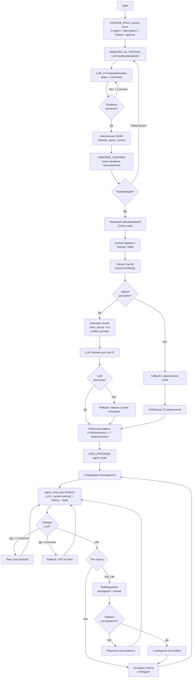

# Workflow - Обработка запроса пользователя

Пошаговый путь от /start до получения программы и работы в agent mode.

```mermaid
flowchart TD
    Start["/start"] --> ChooseRole["CHOOSE_ROLE: выбор роли<br/>(студент / абитуриент / бизнес / другое)"]
    ChooseRole --> OnboardNL["ONBOARD_NL_PROFILE:<br/>LLM-профилирование"]

    OnboardNL --> LLMProfile["LLM: уточняющий вопрос<br/>(макс. 2 реплики)"]
    LLMProfile --> ProfileDone{"Профиль<br/>извлечен?"}
    ProfileDone -- "Нет, < 2 реплик" --> LLMProfile
    ProfileDone -- "Да" --> ExtractJSON["Извлечение JSON:<br/>interests, goals, context"]

    ExtractJSON --> Confirm["ONBOARD_CONFIRM:<br/>показ профиля пользователю"]
    Confirm --> ConfirmDecision{"Подтвержден?"}
    ConfirmDecision -- "Перестроить" --> OnboardNL
    ConfirmDecision -- "Да" --> GenRec["Генерация рекомендаций<br/>(Celery task)"]

    GenRec --> EmbedProfile["Embed профиля<br/>(Gemini 768d)"]
    EmbedProfile --> QdrantSearch["Qdrant: top-30<br/>(cosine similarity)"]

    QdrantSearch --> QdrantOk{"Qdrant<br/>доступен?"}
    QdrantOk -- "Нет" --> TagOverlap["Fallback: пересечение тегов"]
    QdrantOk -- "Да" --> Rerank["Schedule rerank:<br/>room_bonus +3.0<br/>conflict_penalty"]

    TagOverlap --> Padding["Padding до 10 результатов"]
    Rerank --> LLMSummary["LLM: резюме для top-15"]

    LLMSummary --> LLMSumOk{"LLM<br/>доступна?"}
    LLMSumOk -- "Нет" --> FallbackDesc["Fallback: первые строки описания"]
    LLMSumOk -- "Да" --> ShowProgram["Показ программы:<br/>8 обязательных + 7 опциональных"]

    FallbackDesc --> ShowProgram
    Padding --> ShowProgram

    ShowProgram --> AgentMode["VIEW_PROGRAM:<br/>agent mode"]

    AgentMode --> UserMsg["Сообщение пользователя"]
    UserMsg --> CeleryChat["agent_chat_task (Celery):<br/>LLM + system prompt + history + tools"]

    CeleryChat --> LLMTimeout{"Таймаут<br/>LLM?"}
    LLMTimeout -- "Да, < 3 попыток" --> Retry["Retry (exp backoff)"]
    Retry --> CeleryChat
    LLMTimeout -- "Да, 3 попытки" --> FallbackModel["Fallback: GPT-4o-Mini"]
    FallbackModel --> CeleryChat

    LLMTimeout -- "Нет" --> ResponseType{"Тип ответа"}
    ResponseType -- "text" --> SendText["Отправка текста<br/>в Telegram"]
    ResponseType -- "tool_call" --> Dispatch["ToolDispatcher:<br/>валидация + вызов"]

    Dispatch --> ToolTimeout{"Таймаут<br/>инструмента?"}
    ToolTimeout -- "Да" --> ToolError["Сообщение об ошибке"]
    ToolTimeout -- "Нет" --> ToolResult["Результат инструмента"]
    ToolResult --> CeleryChat
    ToolError --> SendText

    SendText --> UserMsg
```
